# Leukocyte Images Classification

System for the automated classification of white blood cells (leukocytes).
Input is a WBC image and the output is the class of the given image.

You can download the LISC (Leukocyte Images for Segmentation and Classification) database
from the following link: http://users.cecs.anu.edu.au/~hrezatofighi/Data/Leukocyte%20Data.htm

An example of each of the five classes of white blood cell is shown in the following figure:

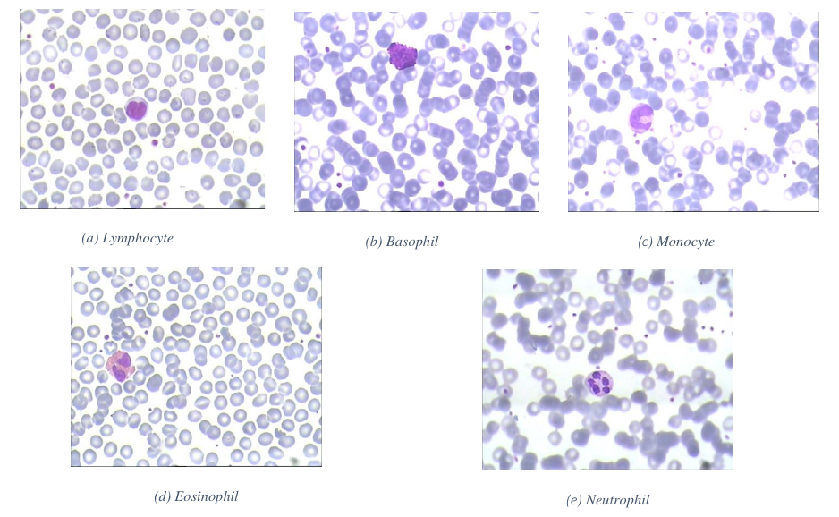

## Table of Contents
  * [Phase 1: Segmentation](#phase-1-segmentation)
    + [Load specimen](#load-a-random-specimen-as-hsv)
    + [Isolate nucleus](#isolate-nucleus)
    + [Prune nucleus](#prune-nucleus)
    + [Isolate surrounding fluid](#isolate-surrounding-fluid)
    + [Prune fluid](#prune-fluid)
    + [Merge nucleus with fluid](#merge-nucleus-with-fluid)
    + [Examples](#examples)
  * [Phase 2: Feature Extraction](#phase-2-feature-extraction)
    + [Training Model](#Training-model)
    + [Layers Details](#layers-details)
    + [Train Result](#train-result)
    + [Using Model](#using-model)

---

## Phase 1: Segmentation


### Load a random specimen as HSV
Different color spaces has been tested (RGB, LAB, LIN) and found **HSV** is most suitable for the given task.


```matlab
img = rgb2hsv(imread('specimen.bmp'));
% Extract the second layer
layer = img(:, :, 2);
imshow(layer);
```


Original RGB Sample | HSV's saturation layer
:---:|:---:
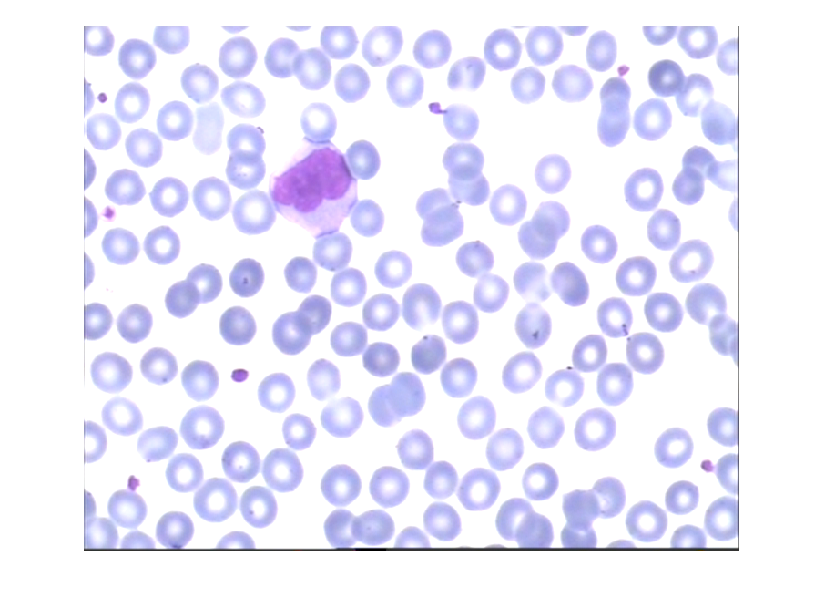 | 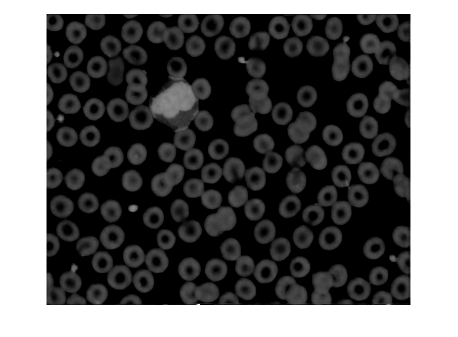


### Isolate nucleus
The process mainly involved carefully incrementing the threshold until an optimal segment has been found.

Here is the result of a careful iterative process over a large sample to extract the nucleus.

```matlab
nucleusThreshold = 0.3686;
p1 = layer > nucleusThreshold;
imshow(p1);
```


### Prune nucleus

Small unwanted artifacts can be removed by an open mask with a disk structural element of size *8*.

```matlab
se = strel('disk', 8);
p1 = imopen(p1, se);
```
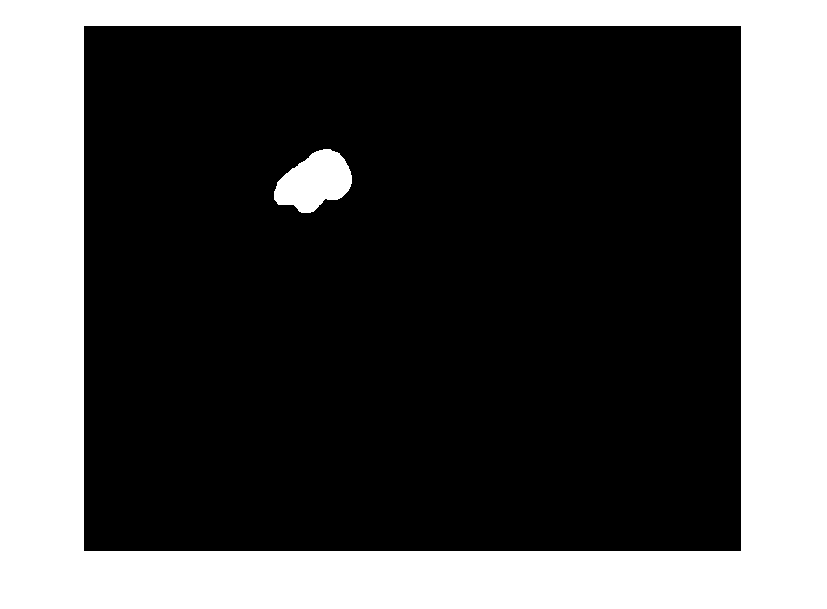

### Isolate surrounding fluid
The surrounding fluid is essential in identifying variations of whiteblood cells.

Similar process of isolating the nucleus has been used to isolate the fluid.

```matlab
fluidThreshold = 0.0980;
p2 = layer > fluidThreshold;
imshow(p2);
```
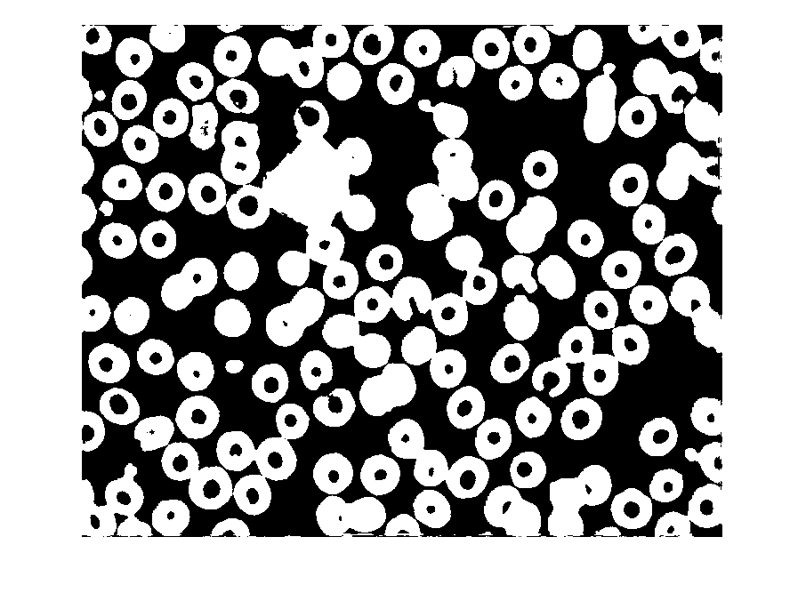


### Prune fluid
Same as nucleus, unwanted artifacts can be removed by an open mask with a disk structural element but with a size *28*.


```matlab
se = strel('disk', 28);
p2 = imopen(p2, se);
imshow(p2);
```


### Merge nucleus with fluid

Here the fluid is given a more distinguished color *(used 150 grey)* then added to the nucleus.

```matlab
p1 = im2uint8(p1);
p2 = im2uint8(p2);
p2(p2 == 255) = 150; % distinguish fluid from nucleus
imshow(p1 + p2);     % combine components
```
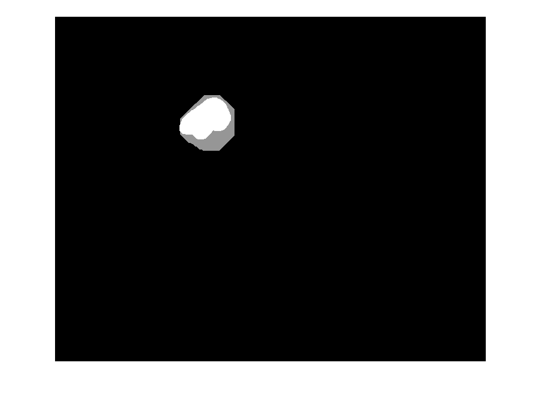

### Examples

```matlab
SAMPLE_SIZE = 6;
for i=1:SAMPLE_SIZE
    res = imread('samples/' + string(i) + '_res.png');
    ref = imread('samples/' + string(i) + '_expert.bmp');
    % figure, imshowpair(res, ref, 'montage');
    subplot(1, 2, 1), imshow(res);
    subplot(1, 2, 2), imshow(ref);
    figure;
end
```
Segmenter | Ground Truth
:---:|:---:
 | 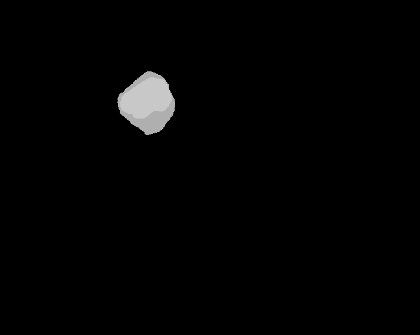
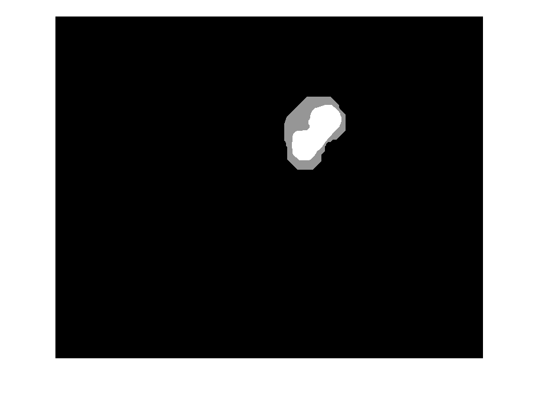 | 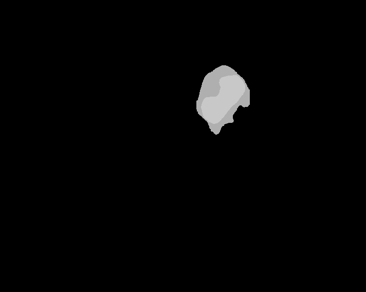
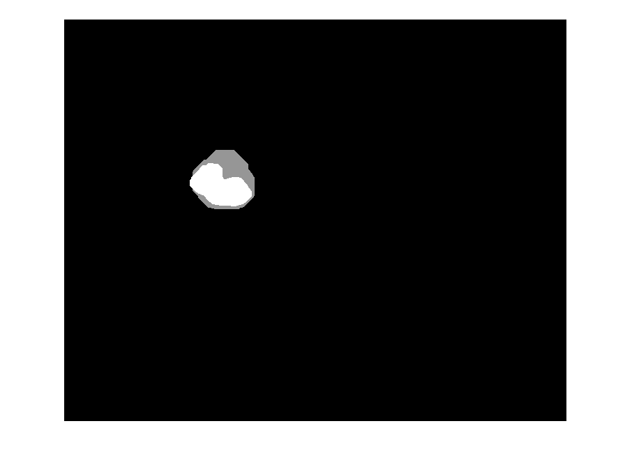 | 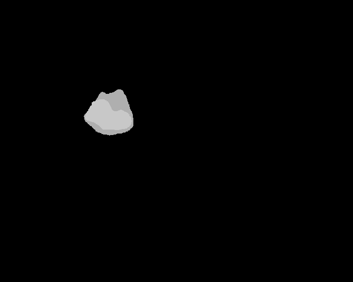
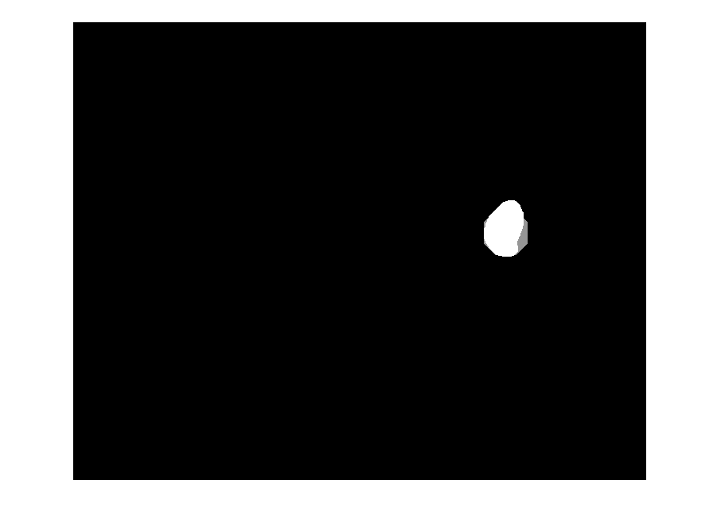 | 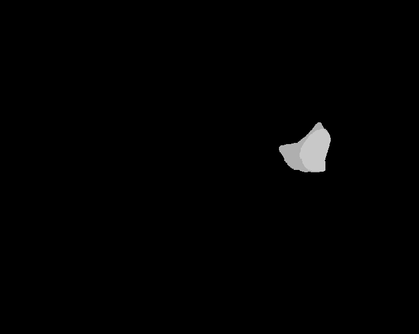
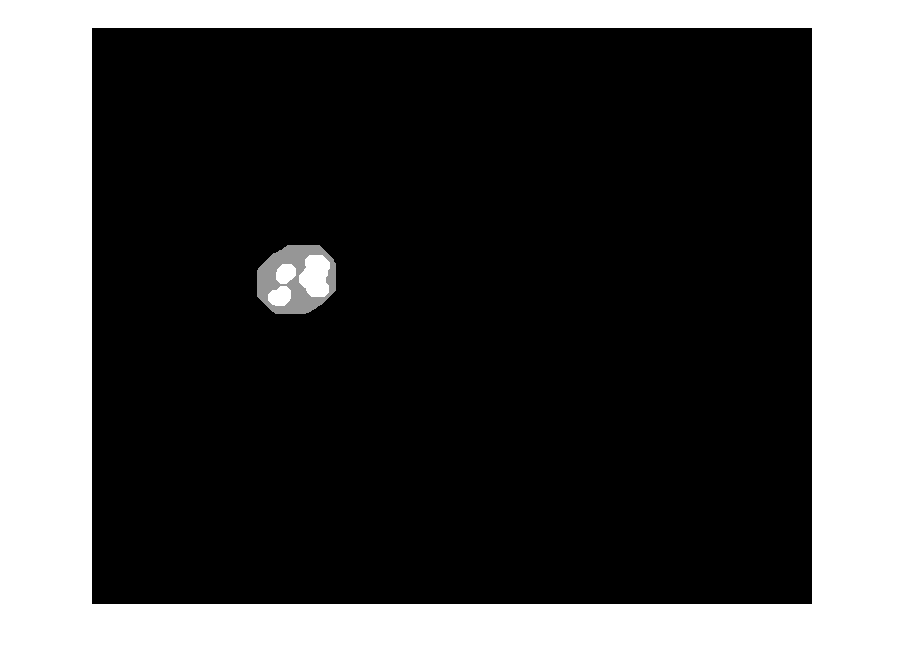 | 
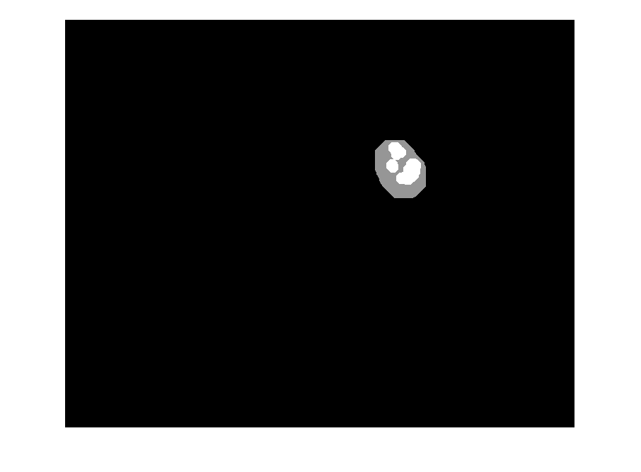 | 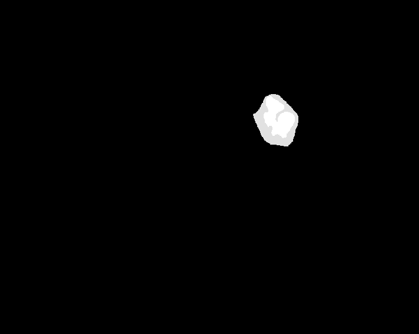


## Phase 2: Feature Extraction

Deep Learning is a machine learning technique that can learn useful representations and features directly from images. A CNN learn these features automatically from images from generic low level features like edge and corners all the way to specific problem features.

Deep Learning algorithms not only perform classification but also learn to extract features directly from image, *thereby eliminate the need for manual feature extraction*.


Instead of training a CNN from scratch, we use a pre-trained CNN model (**VGG-19**) as an automatic feature extract known as **Transfer Learning**.


>**VGG-19** has been trained on over a million images and can classify images into 1000 object categories (such as keyboard, coffee mug, pencil, and many animals).

The network has learned rich feature representations for a wide range of images. The network takes an image as input and outputs a label for the object in the image together with the probabilities for each of the object categories.

Here a demonstration on how to fine-tune a pre-trained **VGG-19 CNN** to perform classification on **LISC image database**.


### Training Model


```matlab
%% Load Dataset
dsTrain = imageDatastore('train', 'IncludeSubfolders', true, ...
                                  'LabelSource', 'foldernames');
dsValidate = imageDatastore('validate', 'IncludeSubfolders', true, ...
                                     'LabelSource', 'foldernames');
%% Resize Dataset
augTrain = augmentedImageDatastore([224 224], dsTrain);
augValidate = augmentedImageDatastore([224 224], dsValidate);
%% Load VGG-19 network
net = vgg19();
analyzeNetwork(net)
%% Replace last layers
layersTransfer = net.Layers(1:end-3);
numClasses = numel(categories(dsTrain.Labels))

layers = [
    layersTransfer
    fullyConnectedLayer(numClasses,'WeightLearnRateFactor', 20, ...
                                   'BiasLearnRateFactor', 20)
    softmaxLayer
    classificationLayer];

%% Network options
options = trainingOptions('sgdm', ...
                        'MiniBatchSize',10, ...
                        'MaxEpochs',6, ...
                        'InitialLearnRate',1e-4, ...
                        'Shuffle','every-epoch', ...
                        'ValidationData',augValidate, ...
                        'ValidationFrequency',3, ...
                        'Verbose',false, ...
                        'Plots','training-progress');
%% Train Network
vgg19LISC = trainNetwork(augTrain, layers, options);
```

### Layers Details


Layer Number | Name | Type | Description
:---:|:---:|:---:|:---:
1  | input       | **Image Input**           | 224x224x3 images with 'zerocenter' normalization                             
2  | conv1\_1    | **Convolution**           | 64 3x3x3 convolutions with stride [1  1] and padding [1  1  1  1]    
3  | relu1\_1    | **ReLU**                  | ReLU                                                                         
4  | conv1\_2    | **Convolution**           | 64 3x3x64 convolutions with stride [1  1] and padding [1  1  1  1]   
5  | relu1\_2    | **ReLU**                  | ReLU                                                                         
6  | pool1       | **Max Pooling**           | 2x2 max pooling with stride [2  2] and padding [0  0  0  0]          
7  | conv2\_1    | **Convolution**           | 128 3x3x64 convolutions with stride [1  1] and padding [1  1  1  1]  
8  | relu2\_1    | **ReLU**                  | ReLU                                                                         
9  | conv2\_2    | **Convolution**           | 128 3x3x128 convolutions with stride [1  1] and padding [1  1  1  1] 
10 | relu2\_2    | **ReLU**                  | ReLU                                                                         
11 | pool2       | **Max Pooling**           | 2x2 max pooling with stride [2  2] and padding [0  0  0  0]          
12 | conv3\_1    | **Convolution**           | 256 3x3x128 convolutions with stride [1  1] and padding [1  1  1  1] 
13 | relu3\_1    | **ReLU**                  | ReLU                                                                         
14 | conv3\_2    | **Convolution**           | 256 3x3x256 convolutions with stride [1  1] and padding [1  1  1  1] 
15 | relu3\_2    | **ReLU**                  | ReLU                                                                         
16 | conv3\_3    | **Convolution**           | 256 3x3x256 convolutions with stride [1  1] and padding [1  1  1  1] 
17 | relu3\_3    | **ReLU**                  | ReLU                                                                         
18 | conv3\_4    | **Convolution**           | 256 3x3x256 convolutions with stride [1  1] and padding [1  1  1  1] 
19 | relu3\_4    | **ReLU**                  | ReLU                                                                         
20 | pool3       | **Max Pooling**           | 2x2 max pooling with stride [2  2] and padding [0  0  0  0]          
21 | conv4\_1    | **Convolution**           | 512 3x3x256 convolutions with stride [1  1] and padding [1  1  1  1] 
22 | relu4\_1    | **ReLU**                  | ReLU                                                                         
23 | conv4\_2    | **Convolution**           | 512 3x3x512 convolutions with stride [1  1] and padding [1  1  1  1] 
24 | relu4\_2    | **ReLU**                  | ReLU                                                                         
25 | conv4\_3    | **Convolution**           | 512 3x3x512 convolutions with stride [1  1] and padding [1  1  1  1] 
26 | relu4\_3    | **ReLU**                  | ReLU                                                                         
27 | conv4\_4    | **Convolution**           | 512 3x3x512 convolutions with stride [1  1] and padding [1  1  1  1] 
28 | relu4\_4    | **ReLU**                  | ReLU                                                                         
29 | pool4       | **Max Pooling**           | 2x2 max pooling with stride [2  2] and padding [0  0  0  0]          
30 | conv5\_1    | **Convolution**           | 512 3x3x512 convolutions with stride [1  1] and padding [1  1  1  1] 
31 | relu5\_1    | **ReLU**                  | ReLU                                                                         
32 | conv5\_2    | **Convolution**           | 512 3x3x512 convolutions with stride [1  1] and padding [1  1  1  1] 
33 | relu5\_2    | **ReLU**                  | ReLU                                                                         
34 | conv5\_3    | **Convolution**           | 512 3x3x512 convolutions with stride [1  1] and padding [1  1  1  1] 
35 | relu5\_3    | **ReLU**                  | ReLU                                                                         
36 | conv5\_4    | **Convolution**           | 512 3x3x512 convolutions with stride [1  1] and padding [1  1  1  1] 
37 | relu5\_4    | **ReLU**                  | ReLU                                                                         
38 | pool5       | **Max Pooling**           | 2x2 max pooling with stride [2  2] and padding [0  0  0  0]          
39 | fc6         | **Fully Connected**       | 4096 fully connected layer                                                   
40 | relu6       | **ReLU**                  | ReLU                                                                         
41 | drop6       | **Dropout**               | 50\% dropout                                                                 
42 | fc7         | **Fully Connected**       | 4096 fully connected layer                                                   
43 | relu7       | **ReLU**                  | ReLU                                                                         
44 | drop7       | **Dropout**               | 50\% dropout                                                                 
45 | fc          | **Fully Connected**       | 5 fully connected layer                                                      
46 | softmax     | **Softmax**               | softmax                                                                      
47 | classoutput | **Classification Output** | crossentropyex with 'baso' and 4 other classes


### Training Result

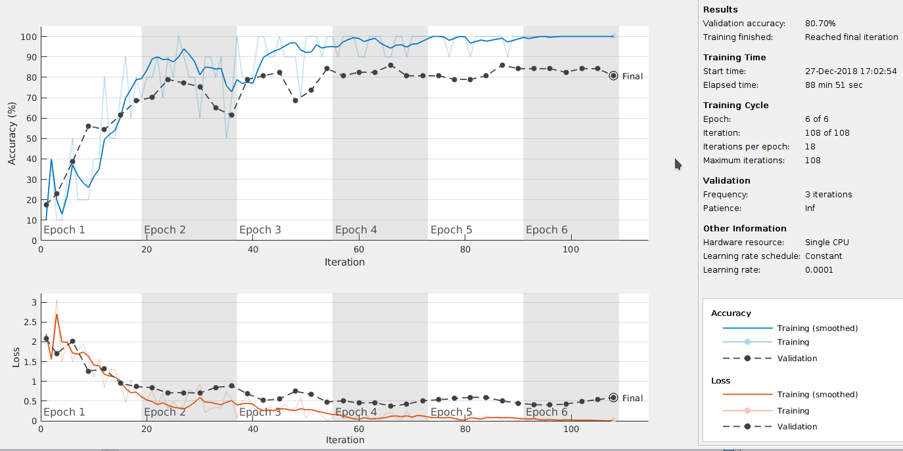

### Using Model

```matlab
%% Load Existing Model
load('vgg19LISC.mat');

sample = imread('sample');
sample = imresize(sample, [224 224]); %% Dont forget to resize sample
```

## Thanks

Special thanks to the man, the myth, the legend, our lord and savior: Mahmoud ElMorshedy